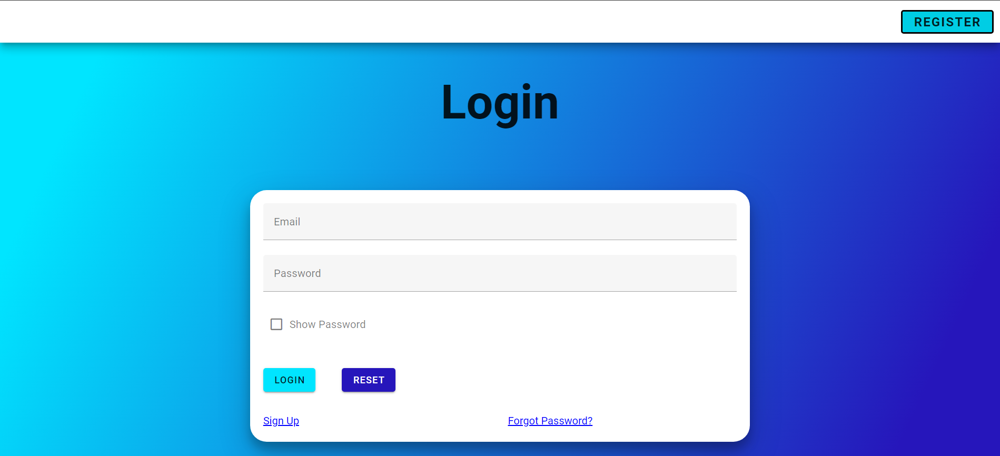
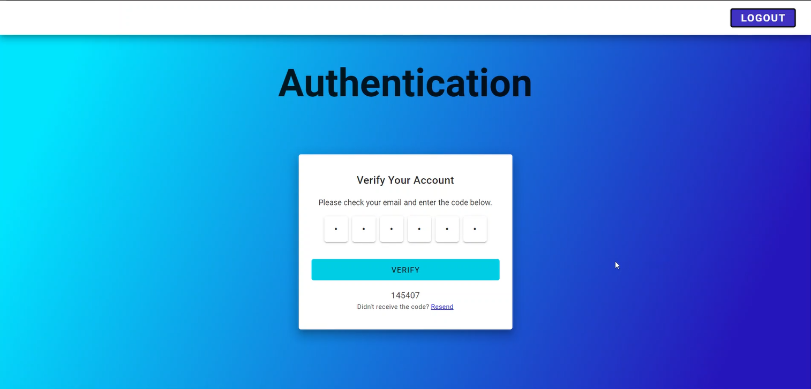
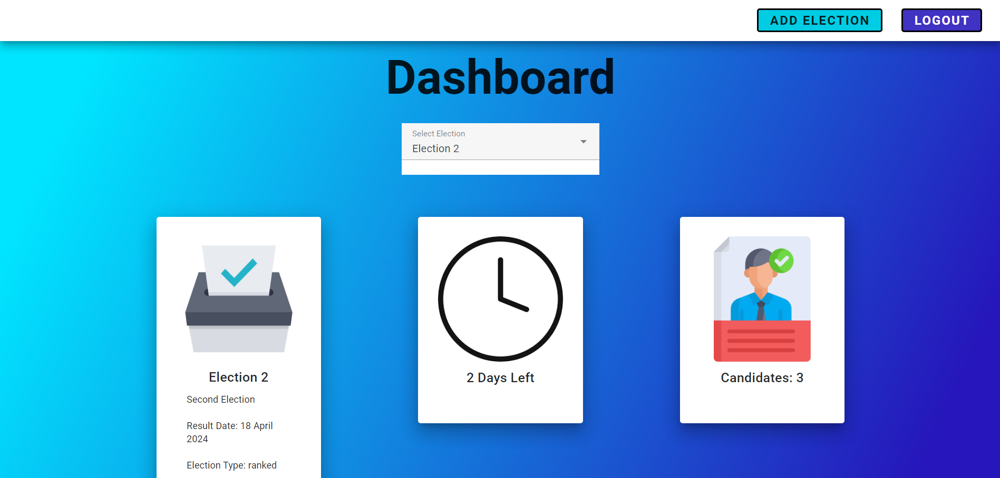

# **Votegrity**

### Authors:

Thomas Kelly - 20361526  
Rishabdev Sidhu - 20309616

### Supervisor:

Geoffrey Hamilton

### Abstract

Votegrity is an innovative blockchain-based voting system designed to enhance the transparency, security, and accessibility of election processes in a world where technology, transparency, and confidence in democratic processes are all fast advancing. Leveraging the decentralized and tamper-resistant nature of blockchain technology, the system ensures the voting integrity of each vote cast while providing a secure and transparent platform for users, employs smart contracts to automate and validate the voting process, eliminating the risk of fraud and manipulation. Votegrity prioritizes user privacy and trust, employing cryptographic techniques to safeguard sensitive information and accommodates various authentication and verification methods, ensuring a seamless and accessible voting experience for all users. 

### Images

### Makefile

Install Dependancies:
- make install-backend
- make install-frontend
- make install-blockchain

  
Test:
- make test

  
Start Servers:
- make start-backend
- make start-frontend